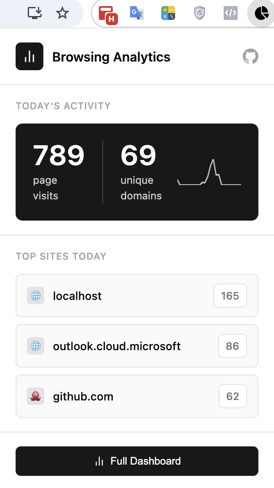
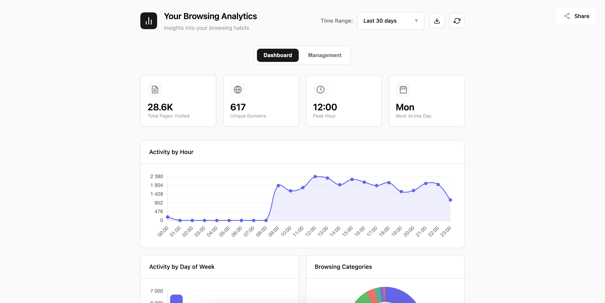
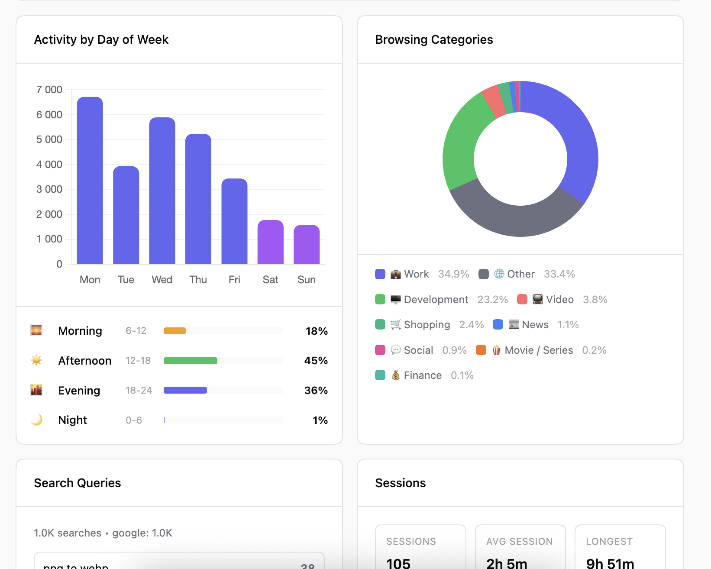
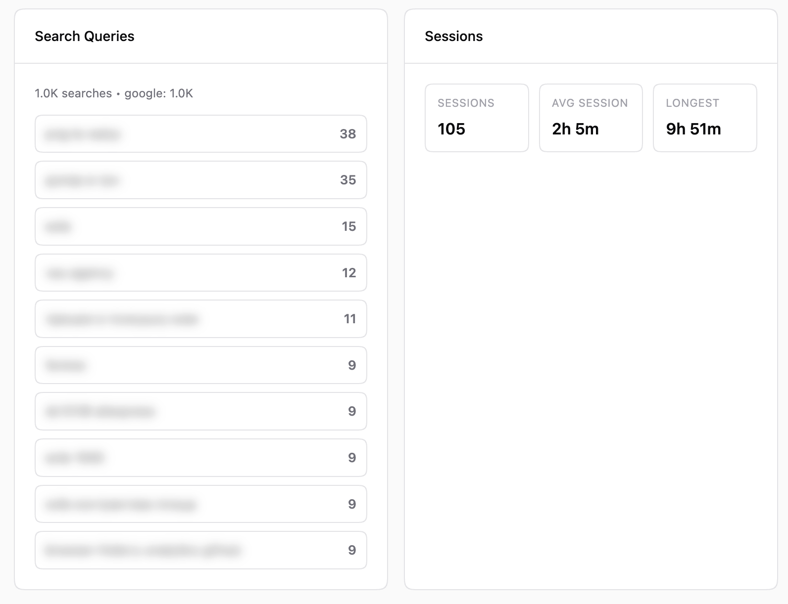
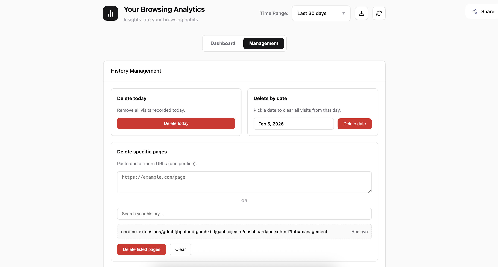
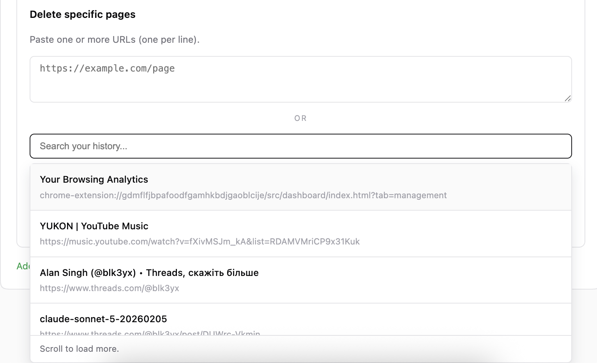
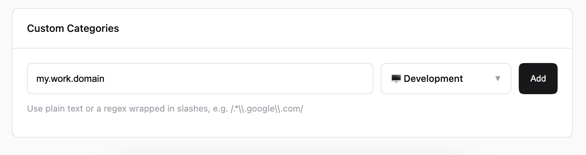

# Your Browsing Analytics

A privacy-focused Chrome extension that analyzes your browsing history locally and provides detailed insights into your web usage patterns.

## Screenshots

### Popup

### Dashboard Overview

### Activity Chart

### Search Queries & Sessions

### History Management

 

### Custom Categories

## Features

- **100% Local Processing** - All data stays on your device. No servers, no tracking, no data collection.
- **Smart Categorization** - 23 built-in categories with 536 rules
- **Visual Analytics** - Interactive charts for hourly/daily activity patterns
- **Date Range Filtering** - Analyze specific time periods
- **History Management** - Delete visits for today, a specific date, or selected URLs (paste list or pick from history)
- **Top Pages Table** - Search and paginate your most visited pages
- **Custom Categories** - Add your own domain/regex rules for categorization
- **Search Queries & Sessions** - Track top searches and session stats (count, average, longest)
- **Export Data** - Export your analytics as JSON

## Categories

Built-in categories (custom rules can add more):

| Category      | Rules | Examples                               |
| ------------- | ----- | -------------------------------------- |
| Development   | 69    | localhost, GitHub, GitLab, Docker      |
| Work          | 60    | Slack, Notion, Jira, Google Docs       |
| Social        | 54    | Facebook, X (Twitter), Reddit, Discord |
| AI            | 28    | ChatGPT, Claude, Gemini, Hugging Face  |
| Russia        | 9     | yandex.ru, mail.ru, rambler.ru         |
| Design        | 7     | Figma, Canva, Dribbble, Adobe          |
| Mail          | 18    | Gmail, Outlook, Office365              |
| Entertainment | 26    | 9GAG, Imgur, Giphy, Rotten Tomatoes    |
| Movies        | 13    | Netflix, Max, Megogo                   |
| Video         | 14    | YouTube, Hulu, Prime Video, Disney+    |
| News          | 40    | NYTimes, BBC, Reuters, Bloomberg       |
| Finance       | 22    | PayPal, Wise, Chase, Stripe            |
| Shopping      | 39    | Amazon, eBay, Etsy, Walmart            |
| Education     | 22    | Coursera, edX, Khan Academy            |
| Productivity  | 10    | Notion, Todoist, Trello, Airtable      |
| Gaming        | 18    | Steam, Epic Games, Riot, EA            |
| Health        | 12    | WebMD, NIH, Mayo Clinic                |
| Travel        | 13    | Booking, Airbnb, Expedia               |
| Music         | 10    | Spotify, SoundCloud, Apple Music       |
| Sports        | 8     | ESPN, NFL, NBA                         |
| Food          | 9     | Allrecipes, Uber Eats, DoorDash        |
| Adult         | 14    | Pornhub, OnlyFans, Patreon             |
| Security      | 21    | OWASP, MITRE, VirusTotal, Shodan       |

## Privacy

- All processing happens locally in your browser
- No data is ever sent to external servers
- No tracking, no analytics collection
- Your browsing data never leaves your device
